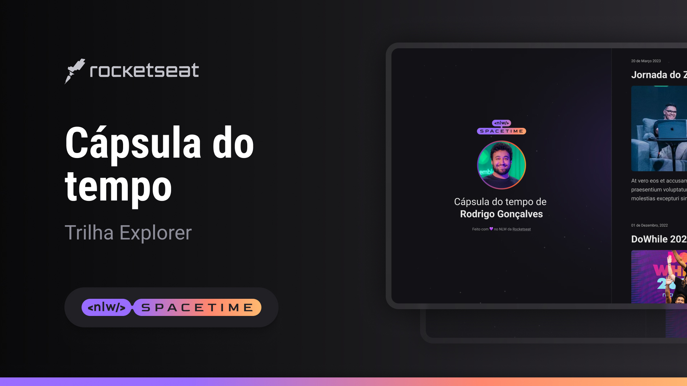

  

## 💻 PROJETO
Esse é um projeto web Responsivo de uma cápsula do tempo para exibir memórias em uma linha do tempo.

## 🚀 TECNOLOGIAS
Esse Projeto foi desenvolvido durante o NLW Spacetime da Rocketseat com as seguintes tecnologias:

- HTML
- CSS
- Git e Github
